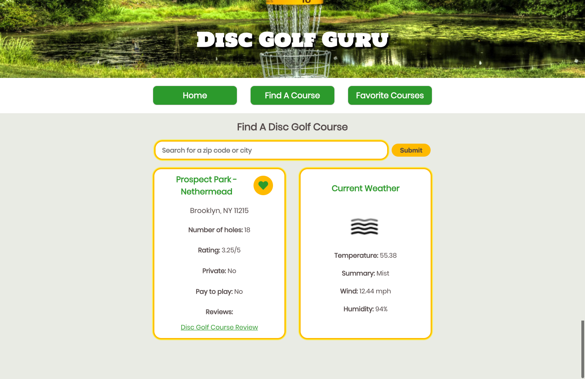

# Disc Golf Guru:
Disc Golf Guru is an application designed to allow users to search for disc golf courses by zip code and/or city, and view information about each course. Such information includes location, number of holes, ratings, and weather forecasts.  This application utilizes the Disc Golf Course Review the Open Weather Map APIs to collect data.  Disc Golf Guru is built primarily using React.js and Redux and testing using Enzyme and Jest.

Please Note: In its current iteration, Disc Golf Guru is only able to search for locations in New York state.  Please see [here](https://www.zip-codes.com/state/ny.asp) for a list of searchable New York zip codes.

## Team Members:
Alex Ela

## To get started:
In the project directory, run: `npm install`
Next, run: `npm start` and open [http://localhost:3000](http://localhost:3000) to view it in the browser.

This project was bootstrapped with [Create React App](https://github.com/facebook/create-react-app).

## Images:
### Home Page

### Search Results

### Golf Course Info

### Favorite Courses

### Wireframes
#### Wireframe 1

#### Wireframe 2

#### Wireframe 3

